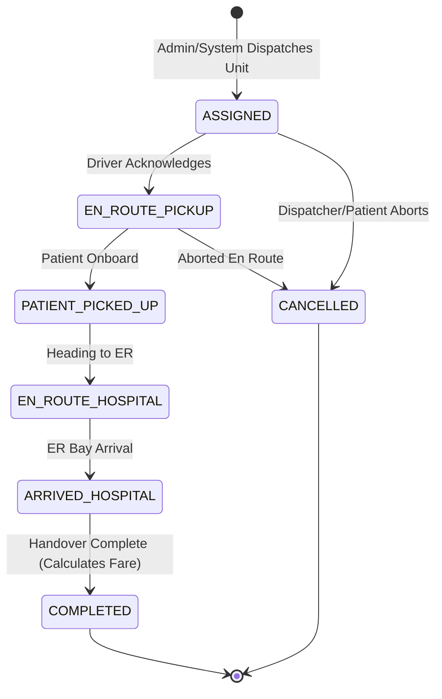

# Emergency Ambulance Dispatch System - Enterprise REST API

[](https://github.com/eistiakahmed/Emergency-Ambulance-Dispatch-Server/actions)
[](https://www.typescriptlang.org/)
[](https://nodejs.org/)
[](https://expressjs.com/)
[](https://www.prisma.io/)
[](https://www.postgresql.org/)
[](https://biomejs.dev/)
[](https://vitest.dev/)
[](https://stripe.com/)

A mission-critical, enterprise-grade backend REST API for emergency ambulance dispatch, live fleet tracking, hospital emergency bed discovery, and automated triage. Built with modern TypeScript, Express 5, Prisma ORM, and PostgreSQL.

---

## 📑 Table of Contents
- [Architecture & Tech Stack](#-architecture--tech-stack)
- [System Roles & Access Control (RBAC)](#-system-roles--access-control-rbac)
- [Dispatch State Machine (FSM)](#-dispatch-state-machine-fsm)
- [Geospatial Dispatch & Distance Computation](#-geospatial-dispatch--distance-computation)
- [API Endpoints Catalog](#-api-endpoints-catalog)
- [Interactive Documentation (Swagger & Postman)](#-interactive-documentation)
- [Local Installation & Setup](#-local-installation--setup)
- [Docker Deployment](#-docker-deployment)
- [Running Automated Tests](#-running-automated-tests)
- [Demo Credentials](#-demo-credentials)

---

## 🛠 Architecture & Tech Stack

- **Runtime & Language:** Node.js 22 (ESM) & TypeScript (ES2022, NodeNext resolution)
- **Framework:** Express 5 with Helmet security headers, CORS, Cookie-Parser, and Morgan logging
- **Database & ORM:** PostgreSQL with a **multi-file Prisma schema** (`prisma/schema/*.prisma`)
- **Validation:** Zod 4 for strict runtime schema validation
- **Authentication:** Dual-token JWT (Short-lived Access Token + Secure HttpOnly Refresh Token Rotation) and Google OAuth (GCP)
- **Payment Gateway:** Stripe Checkout Sessions with raw-body cryptographic webhook signature verification
- **Caching & Geolocation:** Redis / ioredis for spatial driver caching and rate limiting
- **Transactional Notifications:** Nodemailer with EJS dynamic HTML email templates
- **File Storage:** Multer & Cloudinary for avatar and driver document uploads
- **Code Quality:** Biome (formatting, linting, import sorting in <250ms)
- **Testing:** Vitest & Supertest automated end-to-end integration test suites

---

## 👥 System Roles & Access Control (RBAC)

The system enforces strict role-based authorization across 3 fixed roles:

| Role | Permissions |
| :--- | :--- |
| **`PATIENT`** | Create emergency requests, view own emergencies, track assigned ambulance in real-time, view fare estimates, and settle payments via Stripe Checkout. |
| **`DRIVER`** | Update shift status (`AVAILABLE`, `BUSY`, `OFFLINE`), transmit live GPS coordinates, advance assigned trip milestone states (`EN_ROUTE_PICKUP` ➔ `COMPLETED`). |
| **`ADMIN`** | Full system governance: manage fleet, register hospitals & update ICU beds, manual dispatch & trip reassignment, user account moderation, access audit trails and executive analytics KPI dashboard. |

---

## 🔄 Dispatch State Machine (FSM)

Trips follow an immutable, deterministic finite state machine. Status skipping or unauthorized state regression is strictly rejected with a `400 Bad Request`.



---

## 📍 Geospatial Dispatch & Distance Computation

The system features real-time distance and ETA computation grounded in the spherical **Haversine formula**:

$$\text{distance} = 2R \cdot \arcsin\left(\sqrt{\sin^2\left(\frac{\Delta\phi}{2}\right) + \cos(\phi_1)\cos(\phi_2)\sin^2\left(\frac{\Delta\lambda}{2}\right)}\right)$$

- **Auto-matching:** When an emergency is dispatched without a manually assigned unit, the dispatch engine calculates distance between the pickup location and all available units, automatically assigning the nearest operational ambulance.
- **Nearby Search:** Patients and dispatchers can query `/api/v1/ambulances/nearby?latitude=...&longitude=...&radiusKm=25` to inspect available units with real-time ETA estimates.

---

## 📡 API Endpoints Catalog

All responses adhere to the standard envelope format:
- **Success:** `{ "success": true, "message": "...", "data": { ... } }`
- **Error:** `{ "success": false, "message": "...", "errors": [ ... ] }`

### Authentication (`/api/v1/auth`)
| Method | Endpoint | Access | Description |
| :--- | :--- | :--- | :--- |
| `POST` | `/register` | Public | Register new `PATIENT` or `DRIVER` account |
| `POST` | `/login` | Public | Authenticate with email and password |
| `POST` | `/google` | Public | Sign in using Google OAuth ID token |
| `POST` | `/refresh-token` | Public | Exchange refresh token (body or cookie) for new tokens |
| `POST` | `/logout` | Authenticated | Revoke refresh token and clear auth cookies |

### User Profile (`/api/v1/users`)
| Method | Endpoint | Access | Description |
| :--- | :--- | :--- | :--- |
| `GET` | `/me` | Authenticated | Retrieve authenticated user profile |
| `PATCH` | `/me` | Authenticated | Update user profile details |
| `PATCH` | `/me/avatar` | Authenticated | Upload profile avatar via Multer + Cloudinary |

### Hospitals & Emergency Beds (`/api/v1/hospitals`)
| Method | Endpoint | Access | Description |
| :--- | :--- | :--- | :--- |
| `GET` | `/` | Authenticated | List hospitals with pagination, ICU filter & search |
| `GET` | `/:id` | Authenticated | Get hospital details and emergency contact |
| `POST` | `/` | `ADMIN` | Register new hospital |
| `PATCH` | `/:id` | `ADMIN` | Update hospital info |
| `PATCH` | `/:id/beds` | `ADMIN` | Live update available ER / ICU beds |
| `DELETE` | `/:id` | `ADMIN` | Soft delete hospital record |

### Ambulances & Fleet (`/api/v1/ambulances`)
| Method | Endpoint | Access | Description |
| :--- | :--- | :--- | :--- |
| `GET` | `/nearby` | Authenticated | Search nearest available ambulances with ETA |
| `GET` | `/` | Authenticated | List fleet ambulances with pagination & filters |
| `GET` | `/:id` | Authenticated | Get ambulance record details |
| `PATCH` | `/driver/status` | `DRIVER` | Update driver availability and live GPS coordinates |
| `GET` | `/driver/me` | `DRIVER` | Get driver's assigned vehicle and profile |
| `POST` | `/` | `ADMIN` | Register new ambulance vehicle |
| `PATCH` | `/:id` | `ADMIN` | Update ambulance specs and equipment |
| `DELETE` | `/:id` | `ADMIN` | Soft delete ambulance |

### Emergency Requests (`/api/v1/emergencies`)
| Method | Endpoint | Access | Description |
| :--- | :--- | :--- | :--- |
| `POST` | `/` | `PATIENT` | Submit emergency request with priority triage |
| `GET` | `/` | Authenticated | List emergencies (own for Patient, all for Admin) |
| `GET` | `/:id` | Authenticated | Get emergency request details |
| `POST` | `/:id/cancel` | `PATIENT`, `ADMIN` | Cancel pending emergency request |

### Trip Dispatch & State Machine (`/api/v1/trips`)
| Method | Endpoint | Access | Description |
| :--- | :--- | :--- | :--- |
| `POST` | `/dispatch` | `ADMIN` | Atomically match ambulance and dispatch trip |
| `GET` | `/active` | Authenticated | Fetch current ongoing trip for patient or driver |
| `GET` | `/:id` | Authenticated | Get trip details with audit breadcrumb trail |
| `PATCH` | `/:id/status` | `DRIVER`, `ADMIN` | Advance FSM milestone (calculates fare on COMPLETED) |
| `POST` | `/:id/reassign` | `ADMIN` | Reassign trip to another operational ambulance |

### Stripe Payments (`/api/v1/payments`)
| Method | Endpoint | Access | Description |
| :--- | :--- | :--- | :--- |
| `POST` | `/initiate` | `PATIENT` | Create Stripe Checkout Session for completed trip |
| `POST` | `/webhook` | Public (Stripe) | Cryptographic signature verification webhook |
| `GET` | `/:id` | Authenticated | Get payment verification status |
| `GET` | `/trip/:tripId` | Authenticated | Get payment record for trip |

### Administration & Auditing (`/api/v1/admin`)
| Method | Endpoint | Access | Description |
| :--- | :--- | :--- | :--- |
| `GET` | `/dashboard-stats` | `ADMIN` | Executive operational analytics & revenue KPIs |
| `GET` | `/users` | `ADMIN` | Paginated user management list |
| `PATCH` | `/users/:id/role` | `ADMIN` | Promote / demote user role |
| `PATCH` | `/users/:id/status` | `ADMIN` | Activate or suspend user account |
| `GET` | `/audit-logs` | `ADMIN` | Immutable system audit log trail |

---

## 📖 Interactive Documentation

### Swagger UI
Launch the server and navigate to:
```
http://localhost:5000/api/v1/docs
```
Explore, test, and inspect interactive API schemas directly in your browser.

### Postman Collection
Import `src/docs/postman_collection.json` into Postman. It includes pre-configured collection variables (`{{baseUrl}}`, `{{patientToken}}`, `{{driverToken}}`, `{{adminToken}}`) and request payloads for all 25+ endpoints.

---

## 💻 Local Installation & Setup

### Prerequisites
- Node.js >= 22.0.0
- pnpm >= 11.0.0
- PostgreSQL database

### Steps

1. **Clone the repository:**
   ```bash
   git clone https://github.com/eistiakahmed/Emergency-Ambulance-Dispatch-Server.git
   cd Emergency-Ambulance-Dispatch-Server
   ```

2. **Install dependencies using pnpm:**
   ```bash
   pnpm install
   ```

3. **Configure Environment Variables:**
   Copy `.env.example` to `.env`:
   ```bash
   cp .env.example .env
   ```
   Fill in your PostgreSQL `DATABASE_URL`, JWT secrets, and Stripe API keys.

4. **Synchronize Prisma Database:**
   ```bash
   pnpm exec prisma db push
   pnpm exec prisma generate
   ```

5. **Start Development Server:**
   ```bash
   pnpm run dev
   ```
   Server will start at `http://localhost:5000/api/v1`.

---

## 🐳 Docker Deployment

To launch the complete infrastructure (API, PostgreSQL 16, Redis 7) in isolated containers:

```bash
docker compose up --build -d
```

Check container health:
```bash
docker compose ps
curl http://localhost:5000/api/v1/health
```

---

## 🧪 Running Automated Tests

Run the complete Vitest integration test suite (includes authentication, dispatch state machine, geolocation, and payment tests):

```bash
pnpm test
```

Run Biome lint and formatting check:
```bash
pnpm run check
```

---

## 🔑 Demo Credentials

| Role | Email | Password |
| :--- | :--- | :--- |
| **Admin** | `admin@emergency.com` | `AdminPass123!` |
| **Driver 1 (ALS ICU)** | `driver.john@emergency.com` | `DriverPass123!` |
| **Driver 2 (BLS)** | `driver.sarah@emergency.com` | `DriverPass123!` |
| **Patient** | `patient.alice@emergency.com` | `PatientPass123!` |

---

## 📄 License
This project is licensed under the ISC License. Developed by **Eistiak Ahmed**.
